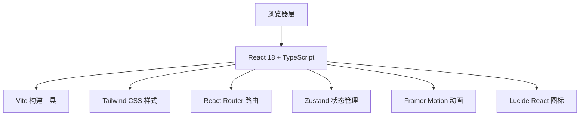

## 1. 架构设计



## 2. 技术描述

- **前端框架**：React 18 + TypeScript
- **构建工具**：Vite 5
- **样式方案**：Tailwind CSS 3 + 自定义CSS变量
- **路由管理**：React Router DOM 6
- **状态管理**：Zustand
- **动画库**：Framer Motion 11
- **图标库**：Lucide React
- **项目初始化**：vite-init react-ts 模板

## 3. 路由定义

| 路由 | 用途 |
|-------|---------|
| / | 首页 - 可交互大脑模型页面 |
| /encyclopedia | 百科页面 - 脑区/神经元/递质知识 |

## 4. 项目目录结构

```
src/
├── components/
│   ├── layout/
│   │   └── Navbar.tsx          # 导航栏组件
│   ├── brain/
│   │   ├── InteractiveBrain.tsx    # 可交互大脑SVG组件
│   │   ├── BrainRegion.tsx         # 脑区组件
│   │   └── InfoPanel.tsx           # 信息弹出面板
│   ├── encyclopedia/
│   │   ├── BrainRegions.tsx        # 脑区介绍卡片
│   │   ├── NeuronStructure.tsx     # 神经元动画组件
│   │   └── Neurotransmitters.tsx   # 神经递质卡片
│   └── shared/
│       ├── GlowCard.tsx            # 发光卡片组件
│       ├── ParticleBackground.tsx  # 粒子背景
│       └── AnimatedSection.tsx     # 动画容器
├── pages/
│   ├── Home.tsx                    # 首页
│   └── Encyclopedia.tsx            # 百科页面
├── hooks/
│   └── useScrollAnimation.ts       # 滚动动画钩子
├── store/
│   └── useBrainStore.ts            # 大脑交互状态
├── data/
│   ├── brainRegions.ts             # 脑区数据
│   ├── neurons.ts                  # 神经元数据
│   └── neurotransmitters.ts        # 神经递质数据
├── types/
│   └── index.ts                    # 类型定义
├── App.tsx
├── main.tsx
└── index.css
```

## 5. 核心数据模型

```typescript
// 脑区类型
interface BrainRegionData {
  id: string;
  name: string;
  nameEn: string;
  color: string;
  position: { x: number; y: number };
  description: string;
  functions: string[];
  facts: string[];
}

// 神经元结构类型
interface NeuronPart {
  id: string;
  name: string;
  description: string;
  color: string;
}

// 神经递质类型
interface Neurotransmitter {
  id: string;
  name: string;
  nameEn: string;
  color: string;
  function: string;
  effects: string[];
  disorders: string[];
}
```

## 6. 技术要点

1. **SVG大脑交互**：使用内联SVG绘制大脑轮廓，各脑区作为独立path元素，支持hover/click事件
2. **粒子背景**：CSS动画实现浮动粒子效果，降低性能开销
3. **滚动动画**：使用Intersection Observer API结合Framer Motion实现入场动画
4. **发光效果**：CSS box-shadow多层叠加 + filter: drop-shadow实现霓虹发光
5. **玻璃拟态**：backdrop-filter: blur + 半透明背景实现毛玻璃效果
6. **响应式布局**：Tailwind响应式断点，移动端适配简化布局
