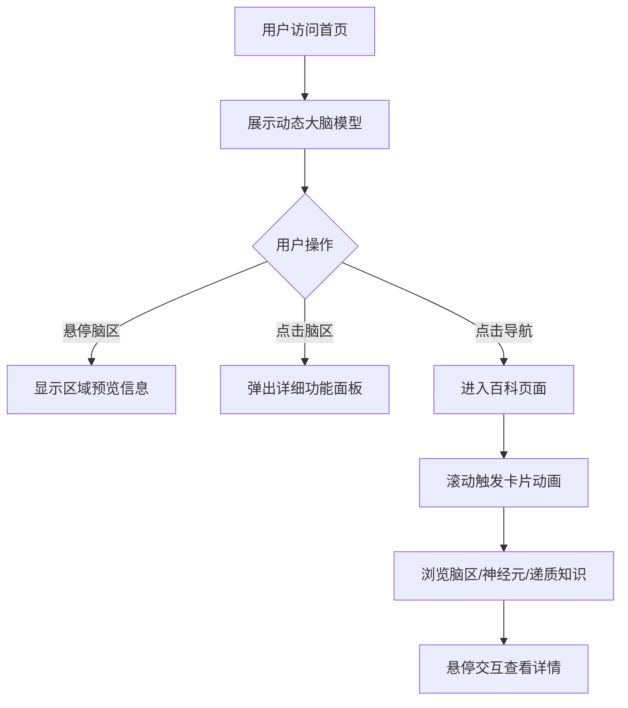

## 1. 产品概述

NeuroMind - 高级黑科学风大脑神经学学习Web应用，通过沉浸式交互体验帮助用户探索大脑奥秘。
- 面向对神经科学感兴趣的学生、研究者和科普爱好者，提供交互式大脑模型和结构化百科知识
- 产品价值：将抽象的神经科学知识转化为可视化、可触摸的沉浸式学习体验

## 2. 核心功能

### 2.2 功能模块
1. **首页 / 大脑交互页**：3D风格可交互大脑模型，导航栏，功能区域选择
2. **百科页面**：脑区介绍、神经元结构、神经递质三大知识模块，带动画效果

### 2.3 页面详情
| 页面名称 | 模块名称 | 功能描述 |
|-----------|-------------|---------------------|
| 首页 | 可交互大脑模型 | SVG/Canvas绘制赛博朋克风格大脑，点击记忆、语言、运动、视觉四个区域高亮展示对应功能介绍 |
| 首页 | 导航系统 | 顶部导航栏，页面切换，带动效过渡 |
| 首页 | 功能信息面板 | 点击脑区后弹出详细功能说明，含数据可视化 |
| 百科页 | 脑区介绍 | 卡片式布局展示主要脑区，滚动触发动画，悬停交互 |
| 百科页 | 神经元结构 | 动画展示神经元各部分（胞体、树突、轴突、突触），分步讲解 |
| 百科页 | 神经递质 | 展示多巴胺、血清素等主要神经递质，信息卡片+动效 |

## 3. 核心流程

用户访问首页 → 看到动态大脑模型（粒子浮动、发光效果）→ 悬停脑区显示预览信息 → 点击脑区弹出详细面板 → 通过导航进入百科页面 → 滚动浏览知识卡片，触发各类动画效果 → 在各知识模块间自由切换

## 4. 用户界面设计

### 4.1 设计风格
- **主色调**：深空黑 `#0a0a0f` 为基底，暗蓝紫 `#1a1a2e` 为辅助背景
- **强调色**：赛博青 `#00f0ff`（主要发光色）、神经粉 `#ff00aa`（次强调）、电光蓝 `#0066ff`
- **按钮风格**：霓虹发光边框，半透明填充，悬停时光晕扩散
- **字体**：标题使用 Orbitron（科幻感），正文使用 JetBrains Mono（技术感）
- **布局风格**：全屏沉浸式，玻璃拟态卡片，网格数据流背景
- **图标风格**：线性发光图标，科技感几何图形

### 4.2 页面设计概述
| 页面名称 | 模块名称 | UI元素 |
|-----------|-------------|-------------|
| 首页 | 大脑模型区 | 全屏SVG大脑，发光粒子，数据流线条，点击高亮脉冲动画 |
| 首页 | 信息面板 | 玻璃拟态弹窗，发光边框，打字机文字效果，数据条形图 |
| 首页 | 导航栏 | 顶部固定，磨砂玻璃效果，悬停下划线霓虹发光 |
| 百科页 | 知识卡片 | 网格布局，入场动画（淡入+位移），悬停3D翻转/缩放，角标装饰 |
| 百科页 | 神经元动画 | SVG分步动画，轴突信号传递动效，突触释放粒子效果 |
| 百科页 | 递质卡片 | 分子结构图形，颜色编码，脉冲发光边框 |

### 4.3 响应性
- 桌面优先设计，自适应到平板和手机
- 移动端大脑模型简化为触控友好的按钮式布局
- 卡片网格响应式调整列数

### 4.4 视觉特效指导
- **背景**：深色渐变+网格线+随机浮动粒子+扫描线效果
- **发光效果**：多重box-shadow模拟霓虹，CSS filter: drop-shadow
- **动画**：页面加载时元素依次入场（staggered reveal），滚动触发视差效果
- **交互反馈**：点击产生涟漪效果，悬停时元素轻微上浮+光晕增强
